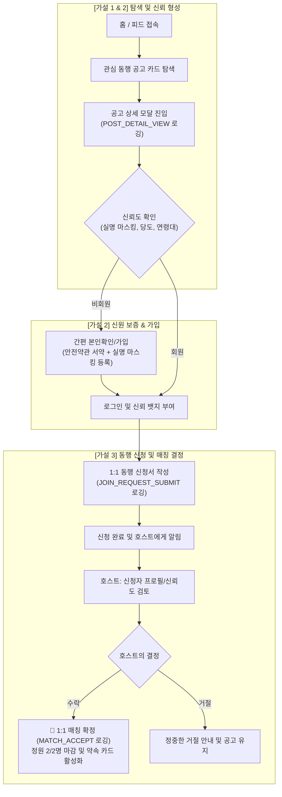

# 🎯 유미당 MVP 핵심 스프린트 유저플로우 체크리스트

> **스프린트 핵심 목표**:  
> 화려한 부가 기능(에스크로 결제, 음성 통화 등)을 걷어내고, **"1:1 동행에 대한 수요", "신뢰 장치를 통한 불안감 해소", "공고 탐색부터 동행 결정(매칭 확정)까지의 전환"**이라는 3가지 핵심 가설만을 가장 빠르고 명확하게 검증합니다.

---

## 📌 3대 핵심 가설 및 검증 목표

| 번호 | 핵심 질문 (검증 가설) | 검증 목표 및 성공 지표 (KPI) | Supabase 검증 뷰 컬럼 |
|---|---|---|---|
| **가설 ①** | **사용자는 일상에서 낯선 사람과 1:1 동행할 만큼 ‘함께할 사람’에 대한 필요를 느끼는가?** | • 공고 조회수 (`POST_DETAIL_VIEW`)<br>• 신규 공고 개설수 (`CREATE_MEETUP_SUBMIT`) | `가설1_공고조회수`<br>`가설1_신규공고개설수` |
| **가설 ②** | **실명 인증과 프로필·신뢰 정보는 낯선 사람과의 1:1 만남에 대한 불안을 낮출 수 있을까?** | • 프로필 확인 후 참여 신청 완료수<br>• 공고 조회 대비 참여 신청 전환율 (%) | `가설2_참여신청완료수`<br>`가설2_공고대비_신청전환율(%)` |
| **가설 ③** | **사용자는 동행 공고와 상대 정보를 확인한 뒤 참여를 요청하고, 실제 동행을 결정할 수 있을까?** | • 호스트의 최종 매칭 수락 및 확정수<br>• 신청 접수 대비 수락 성사율 (%) | `가설3_최종매칭확정수`<br>`가설3_신청대비_수락성공률(%)` |

---

## 🗺️ MVP 핵심 유저플로우 (End-to-End)



---

## ✅ MVP 유저플로우 구현 완료 체크리스트

### Phase 1. 가설 ① 검증: ‘함께할 사람’에 대한 일상적 수요 포착 [구현 완료]

> **목표**: 사용자가 혼자 하기 애매하거나 함께하고 싶은 일상 활동(맛집, 전시, 러닝, 산책 등)을 등록하고 찾아보는가?

- [x] **1-1. 메인 피드 & 동행 공고 리스트**
  - [x] 한눈에 들어오는 목적 지향형 카드 (카테고리, 일시, 장소, 제목)
  - [x] 1:1 전용 정원 표기 (`1/2명 모집 중` / `2/2명 매칭 완료`)
  - [x] 모집 상태 필터링 (모집 중인 모임만 보기 토글)
- [x] **1-2. 초간편 1:1 동행 공고 개설 (호스트 플로우)**
  - [x] 필수 5가지 핵심 항목 입력 (카테고리, 제목, 일시, 만날 장소, 동행 파트너 바라는 점)
  - [x] "1:1 매칭 (정원 2명)" 규칙 고정
  - [x] 공고 등록 완료 시 즉시 피드 최상단 노출 및 알림 발생
- [x] **1-3. 수요 측정 데이터 로깅 (Supabase 연동)**
  - [x] 공고 카드 클릭 시 상세 조회수 실시간 카운트 (`POST_DETAIL_VIEW`)
  - [x] 신규 공고 개설 완료 이벤트 로깅 (`CREATE_MEETUP_SUBMIT`)

---

### Phase 2. 가설 ② 검증: 실명 마스킹과 프로필 신뢰 정보가 불안을 낮추는가? [구현 완료]

> **목표**: 익명 닉네임이 주는 위험성을 배제하고, "실명 마스킹 + 매너 당도"가 첫 만남의 심리적 저항을 실질적으로 낮추는가?

- [x] **2-1. 안심 실명제 & 본인확인 플로우**
  - [x] 만 19세 이상 성인 확인 및 1:1 동행 안전 수칙 필수 서약
  - [x] 가공된 닉네임 대신 **본인 실명 마스킹(`조*미`, `홍*동`)을 공식 활동명으로 강제**
  - [x] 이메일 소유권 확인(OTP) 및 간편 테스트 모드 지원
- [x] **2-2. 프로필 내 신뢰 시그널 노출**
  - [x] 공고 상세 화면에서 호스트의 **실명 마스킹 + 성별 + 연령대** 표기
  - [x] 유미당 신뢰 지표인 **기본 시작 당도(50 🍯 / 99 🍯)** 및 안심 인증 뱃지 노출
  - [x] 1:1 만남 시 안전을 위한 공개 만남 장소 표기 및 **상세 비밀 장소는 매칭 확정자에게만 비공개 보호**
- [x] **2-3. 불안 완화 지표 측정 (Supabase 연동)**
  - [x] 상세 모달 체류 시간 및 이탈 추적 (`ui_back_events`, `ui_back_stats_view`)
  - [x] 신뢰 정보 확인 후 [1:1 동행 신청하기] 버튼 클릭 전환율 추적 (`JOIN_REQUEST_OPEN`)

---

### Phase 3. 가설 ③ 검증: 공고 확인 후 신청 & 실제 동행 결정(매칭)이 성사되는가? [구현 완료]

> **목표**: 신청자는 부담 없이 노크하고, 호스트는 상대 정보를 보고 안전하다고 판단하여 매칭을 확정 짓는가?

- [x] **3-1. 1:1 참여 신청 플로우 (게스트 플로우)**
  - [x] 공고 상세 하단 명확한 보라색 CTA 버튼: `[1:1 동행 참여 신청하기]`
  - [x] 과도한 질문지 배제: 가벼운 1~2줄 소개 메시지 작성 모달
  - [x] 신청 완료 시 실시간 이벤트 로깅 (`JOIN_REQUEST_SUBMIT`)
- [x] **3-2. 호스트 검토 및 매칭 확정 (호스트 플로우)**
  - [x] 헤더 상단에 받은 동행 신청함(`btn-match-requests`) 배지 알림 표시
  - [x] 신청자의 프로필 카드(실명 마스킹, 성별, 연령대, 당도, 신청 메시지) 확인 UI
  - [x] 직관적인 두 개의 액션: `[수락]` vs `[거절]`
- [x] **3-3. 1:1 매칭 확정 잠금 (Single Lock Mechanism)**
  - [x] `[수락]` 클릭 시 공고 정원이 즉시 `2/2명`으로 자동 전환되며 추가 신청 자동 차단
  - [x] 동일 공고의 다른 대기 신청자들은 자동으로 정중한 거절 상태로 변경
  - [x] 양측 화면에 최종 확정된 **"1:1 동행 약속 카드"** 활성화
- [x] **3-4. 최종 전환율 측정 (Supabase 연동)**
  - [x] 호스트의 수락 시 실시간 매칭 확정 이벤트 로깅 (`MATCH_ACCEPT`)
  - [x] 신청 대비 최종 수락 매칭 성사율(%) 실시간 계산 뷰 연동

---

## 📊 Supabase 실시간 가설 검증 쿼리

Supabase SQL Editor에서 아래 쿼리를 실행하시면 3대 가설의 실시간 수치를 즉시 확인하실 수 있습니다:

```sql
-- 3대 핵심 가설 검증 요약 뷰
SELECT * FROM public.mvp_hypothesis_metrics_view;
```

**결과 예시 화면**:
| 가설1_공고조회수 | 가설1_신규공고개설수 | 가설2_참여신청완료수 | 가설2_공고대비_신청전환율(%) | 가설3_최종매칭확정수 | 가설3_신청대비_수락성공률(%) |
|---|---|---|---|---|---|
| **14** | **3** | **5** | **35.7%** | **4** | **80.0%** |

---

## 🚫 MVP에서 의도적으로 배제(제외)한 부가 기능

핵심 가설 검증의 속도와 집중을 흐리지 않기 위해 이번 스프린트에서는 아래 기능을 제외 상태로 유지합니다:
- ❌ **유료 프로 호스트 및 에스크로 결제**: 순수 1:1 동행 수요 검증에 집중
- ❌ **실시간 음성 통화(WebRTC)**: 1:1 확정 약속 카드로 간소화
- ❌ **실시간 GPS 위치 추적**: 지하철역/공공장소 중심의 사전 합의로 운영
- ❌ **3인 이상 단체 모임**: 1:1 집중도 유지
