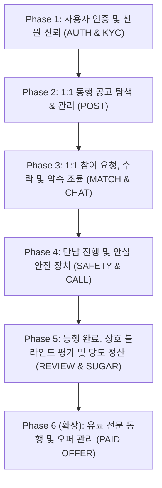

# 유미당 (YouMeDang) 전체 PRD 기능 단계별 구현 로드맵 (ROADMAP.md)

> 본 문서는 유미당 서비스 기획서(PRD)의 모든 요구사항을 체계적으로 실현하기 위해 **우선순위(P0~P2)와 5단계 페이즈(Phase 1 ~ Phase 5)**로 나눈 전체 기능 구현 로드맵입니다.

---

## 🧭 핵심 원칙 요약
1. **1:1 단일 매칭 원칙**: 모든 동행은 **호스트 1인 + 게스트 1인 = 총 2명 (`2/2명`)** 고정입니다.
2. **신뢰 지표 '당도'**: 매너온도 대신 **당도 99 🍯** 체계를 기반으로 상호 평가를 정산합니다.
   - 기본 가입 당도: **`50 🍯`**
   - 긍정 평가 시 점진 상승, 노쇼 및 비매너 신고 시 대폭 하락
   - 1:1 대화방, 신청서, 마이페이지 등 모든 UI에서 당도 지표 일원화(To-Be)
3. **안전 최우선**: 실명 마스킹, 휴대폰/KYC 인증, 상세 장소 비공개 보호, 노쇼/신고 체계를 갖춥니다.

---

## 📊 현재 구현 상태 (As-Is) vs 목표 (To-Be)

| 구분 | 현재 구현 상태 (v1.2.0) | 최종 목표 (Full PRD) |
| :--- | :--- | :--- |
| **브랜드 & UI** | ✅ 신규 마스코트 로고, 12개 카테고리 벡터 아이콘 | 실서비스 브랜드 에셋 완성 |
| **인원 규격** | ✅ 모든 화면 1:1 규격 고정 (`1/2명`, `2/2명`) | 1:1 트랜잭션 동시성 제어 및 잠금 |
| **인증 (Auth)** | ⚪ 인증회원 뱃지 목업 표시 | 휴대폰 OTP 인증 모달, 약관 동의, 실명 마스킹 |
| **공고 관리** | ⚠️ 기본 등록 및 리스트 조회 가능 | 공고 수정/삭제/수동마감, 상세 비밀장소 마스킹 |
| **매칭 플로우** | ⚠️ 단방향 신청 알림 | 참여 요청 목록, 호스트 수락/거절, 단일 확정 |
| **채팅 & 약속** | ⚠️ 정적 메시지 목록, 당도 99.2 표시 | 실시간 메시지 전송, 약속 조건 변경 제안 카드 |
| **안전 장치** | ⚪ UI 메뉴만 존재 | 안전 수칙 안내, 신고/노쇼 접수, 안심 음성통화 |
| **평가 & 당도** | ⚠️ 당도 99.2 🍯 고정 UI | 동행 완료 처리, 상호 블라인드 평가, 당도 가감 정산 |

---

## 🚀 단계별 구현 계획 (Implementation Phases)

---

### [Phase 1] 사용자 인증 및 신원 신뢰 기반 구축 (AUTH & KYC)
> **목표**: 서비스 가입 장벽을 낮추면서도 1:1 만남의 최소 신뢰성을 보장하는 본인인증 체계 구축

- [x] **1-1. 약관 동의 및 본인 확인 온보딩 (`AuthModal.tsx`)** `[P0]`
  - 서비스 이용약관, 개인정보 처리방침, 만 19세 이상 성인 확인 필수 동의 체크박스
- [x] **1-2. 휴대폰 OTP 인증 시뮬레이션** `[P0]`
  - 휴대폰 번호 입력 및 90초 타이머 카운트다운
  - 6자리 인증번호 입력 및 유효성 검증
  - (정식 1원 계좌인증 전환 예정 정책 안내 문구 포함)
- [x] **1-3. 안심 실명 마스킹 시스템 (`maskRealName`)** `[P0]`
  - 실명 입력 시 프로필 및 공고에는 자동으로 마스킹 처리 (`홍길동` → `홍*동`, `조유미` → `조*미`)
  - 성별, 연령대(20대, 30대 등) 설정
- [x] **1-4. 선택형 KYC 인증 마크 연동 (`KycAuthModal.tsx`)** `[P1]`
  - 본인확인 완료 시 프로필에 보라색 공식 인증 뱃지 부여
  - 비용 안내(약 2,000~3,000원 사용자 부담 안내 모달)
- [x] **1-5. 로그인/로그아웃 세션 상태 관리 (`App.tsx`)** `[P0]`
  - 비로그인 사용자는 공고 둘러보기만 가능, 글쓰기/참여 시 로그인 모달 자동 호출

---

### [Phase 2] 1:1 동행 공고 탐색 & 관리 고도화 (POST & DISCOVERY)
> **목표**: 1:1 맞춤형 동행 조건을 상세히 명시하고, 비확정자로부터 프라이버시를 지키는 공고 시스템

- [x] **2-1. 공고 작성 필드 고도화 (`CreateMeetupModal.tsx`)** `[P0]`
  - 1:1 정원 고정 (`2/2명`)
  - **공개 장소**(예: 안국역 2번 출구 앞)와 **확정자 전용 상세 비밀 장소**(예: 어니언 안국 3번 테이블) 분리 입력
  - 동행 파트너에게 바라는 점 / 사전 질문 (예: "비흡연자 선호해요", "반려견 동반 괜찮으신가요?")
- [x] **2-2. 상세 장소 프라이버시 마스킹 (`PostDetailModal.tsx`)** `[P0]`
  - 미확정자: "상세 만남 장소는 매칭 확정 후 공개됩니다 🔒" 블러 처리
  - 매칭 확정자: 실제 상세 장소 및 오시는 길 해제
- [x] **2-3. 공고 수정, 수동 마감 및 삭제** `[P1]`
  - 작성자 본인 공고에 대한 수정/마감 버튼 동작
  - 마감 시 상태를 즉시 `2/2명 (마감)`으로 전환
- [x] **2-4. 공고 자동 만료 스케줄러** `[P0]`
  - 약속 시간이 지난 공고는 자동으로 `기간 만료` 상태로 전환

---

### [Phase 3] 1:1 참여 요청, 매칭 확정 및 조율 (MATCH & CHAT)
> **목표**: 호스트와 게스트 간의 1:1 매칭 결정 과정과 일정 조율의 신뢰성 확보

- [x] **3-1. 참여 요청 발송 및 소개 메시지 작성 (`JoinRequestModal.tsx`)** `[P0]`
  - 게스트가 공고에 1:1 참여 신청 시, 간단한 소개와 인사 메시지 첨부
- [x] **3-2. 호스트의 받은 요청 목록 확인 및 수락/거절 (`MatchRequestsModal.tsx`)** `[P0]`
  - 신청자의 프로필, **당도(🍯)**, 소개 메시지를 비교하여 수락 또는 정중한 거절 선택
- [x] **3-3. 1:1 단일 확정 트랜잭션 (Single Lock) (`App.tsx`)** `[P0]`
  - 1명의 요청을 수락하는 즉시 **`2/2명 매칭완료`**로 잠금
  - 해당 공고의 다른 대기 중인 참여 요청은 자동으로 '마감 안내(거절)' 처리
  - 수락 즉시 1:1 채팅방 개설 및 연결
- [x] **3-4. 1:1 채팅방 내 조건 변경 제안 카드 (`ChatView.tsx`)** `[P1]`
  - 약속 일시 또는 장소 변경 시 채팅창 내에 `[일정/장소 제안]` 모달 및 제안 카드 렌더링
  - 상대방이 [수락하기] 클릭 시 약속 카드 상단 정보 자동 업데이트, [거절] 시 기존 일정 유지
- [x] **3-5. 일정 중복 충돌 경고 (`JoinRequestModal.tsx`)** `[P1]`
  - 이미 다른 1:1 동행이 확정된 시간대와 겹칠 경우 신청 전 실시간 경고 배너 표시

---

### [Phase 4] 만남 진행 및 안심 안전 장치 (SAFETY & CALL)
> **목표**: 실제 오프라인 만남 당일 안전을 지키고 불안감을 해소하는 안전 기능

- [x] **4-1. 만남 전 안심 안전 수칙 팝업 (`SafetyRulesModal.tsx`)** `[P0]`
  - 공공장소 만남, 음주 강요 금지, 비상 연락망 등록 및 안전 서약 인터랙션
- [x] **4-2. 가상 안심 음성 통화 시뮬레이션 (`VoiceCallModal.tsx`)** `[P0]`
  - 개인 전화번호 노출 없는 1:1 앱 내 통화
  - 통화 연결음, 음소거, 스피커폰, 통화 타이머, 통화 종료 인터페이스 구현
- [x] **4-3. 긴급 신고 및 노쇼(No-Show) 접수 센터 (`ReportModal.tsx`)** `[P0]`
  - 약속 장소에 20분 이상 미출현 시 [노쇼 신고] 사유 선택 및 즉시 접수
  - 비매너/위험 행동 즉시 신고 접수 및 운영진 제재 플래그 (당도 -20 Brix 패널티 경고)
- [x] **4-4. D-Day 및 1시간 전 약속 리마인더 알림** `[P1]`
  - 참여 대시보드 내 [10분 전 도착 예정 알림 전송] 및 약속 리마인더 연동

---

### [Phase 5] 동행 완료, 상호 블라인드 평가 및 당도 정산 (REVIEW & SUGAR)
> **목표**: 보복성 평가를 방지하고 만남 경험을 바탕으로 유미당 '당도'를 축적하는 선순환 완성

- [ ] **5-1. 동행 완료 처리 CTA (`MatchDetailView.tsx`)** `[P0]`
  - 약속 시간이 지난 후 [동행이 잘 끝났어요] 버튼 활성화
- [ ] **5-2. 상호 블라인드 평가 모달 (`ReviewModal.tsx`)** `[P0]`
  - 평가 항목: 시간 약속 준수, 매너와 배려, 대화 만족도, 다시 만나고 싶은지 여부
  - **블라인드 원칙**: 내가 평가를 제출해도 상대방이 제출하기 전까지는 상대 점수 비공개
- [ ] **5-3. 동시 해제 및 실시간 당도(Sugar Content) 정산** `[P0]`
  - 양측 모두 평가를 완료하거나 24시간 경과 시 평가 결과 동시 공개
  - 긍정 평가 시: **당도 상승** (예: `99.2 🍯` 유지 및 상승)
  - 노쇼/비매너 신고 접수 시: 당도 급감 및 경고 조치
- [ ] **5-4. 마이페이지 후기 탭 및 당도 히스토리** `[P1]`
  - 받은 동행 뱃지(친절한 동행러, 시간엄수 마스터 등) 프로필에 노출

---

### [Phase 6 - 확장] 유료 전문 동행 및 오퍼 관리 (PAID OFFER)
> **목표**: 전문 지식(외국어 가이드, 운동 코칭, 사진 촬영 등)을 제공하는 유료 동행 확장

- [ ] **6-1. 유료 오퍼 등록 폼** `[P2]`
  - 시간당 비용, 포함/불포함 내역, 활동 커리큘럼 명시
- [ ] **6-2. 견적 제안 및 수락/결제 플로우** `[P2]`
  - 요청자 조건 확인 후 수락 및 안전 에스크로 결제 가상 처리

---

## 📅 실행 일정 및 마일스톤 권장안

| 마일스톤 | 구현 범위 | 기대 산출물 |
| :--- | :--- | :--- |
| **Sprint 1** | **Phase 1 (인증 & 신원)** + **Phase 2 (공고 관리 고도화)** | • 휴대폰 OTP & 실명 가입 모달 • 상세 장소 마스킹 & 1:1 공고 관리 |
| **Sprint 2** | **Phase 3 (1:1 매칭 & 채팅 조율)** | • 참여 요청/수락 1:1 단일 확정 • 조건 변경 제안 카드 채팅 연동 |
| **Sprint 3** | **Phase 4 (안전 & 안심 통화)** + **Phase 5 (평가 & 당도 정산)** | • 안심 음성통화, 신고/노쇼 시스템 • 상호 블라인드 평가 및 실시간 당도 정산 |
| **Sprint 4** | 전체 통합 테스트 & 디자인 디테일 폴리싱 | • QA 완료 및 최종 프로덕션 배포본 |

---

## ✅ 정의된 완료 기준 (DoD: Definition of Done)

1. **기능 검증**: 모든 1:1 동행 공고 및 참여가 2인 정원(`2/2명`)을 철저히 유지하는가?
2. **신뢰 검증**: 만남 후 상호 블라인드 평가가 정상 반영되어 마이페이지의 **당도 99.2 🍯**가 동적으로 연동되는가?
3. **타입 및 빌드 안정성**: `npm run lint` 및 `npm run build`에서 에러 없이 100% 무결점을 만족하는가?
